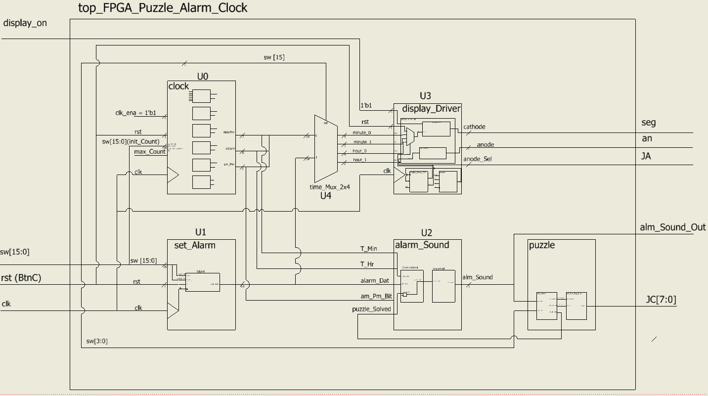

**FPGA Puzzle Alarm Clock**

**Project Overview**

The point of this project was to create an alarm clock whose alarm
signal would only turn off after two peripheral puzzles were completed.
The four onboard seven-segment displays will display the current time in
military time. The user can use the last two onboard switches to set
both the regular time and the alarm time. When the regular time and the
alarm time are equal the alarm will be set off and the first puzzle will
activate.

When the alarm is active, the first puzzle will display a hexadecimal
value (0-F) on a singular external seven-segment display. The user must
then use the first four switches on the Basys 3 board to input the
binary representation of the displayed value. Once the first puzzle is
solved the external seven-segment display will turn off and the second
puzzle will be activated. The second puzzle is a take on the classic
game Simon Says. Four external LEDs are arranged in the same shape as
the four buttons on the Basys 3 board, excluding the middle button. When
the puzzle begins a predetermined randomized pattern will light up one
of the four LEDs . This will occur four times, where there is a delay in
between each of the LEDs lighting up. Once the fourth LED had been lit
up, the user will then input the pattern to the system by pressing the
four buttons on the board in the correct pattern, corresponding to the
LEDs layout. If the user is correct in his pattern input the system will
turn off the alarm and resume normal clock functionality. If the user is
incorrect, the pattern will be shown again, and the user will get
another try at inputting the pattern. The block diagram for this design
can be seen below.

**Hardware Used**

  - Digilent Basys 3 Artix-7 Fpga Trainer Board

**Built Using**

  - Vivado HLx 2019.1

**Authors**

This project was done by Grant Gsell
